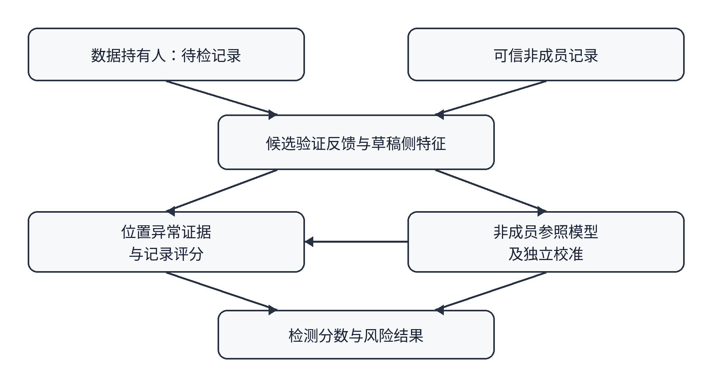
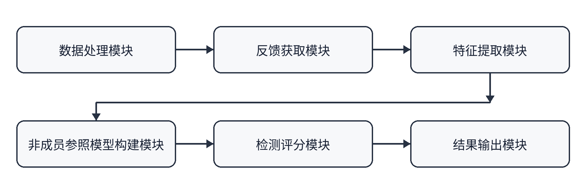

# 说   明   书   摘   要

本发明公开了一种基于投机解码反馈的训练数据使用检测方法及装置。检测装置将待检数据构造成候选记录，获取投机解码验证过程中的接受反馈并提取统计特征；利用可信非成员数据训练反馈参照模型，学习未用于目标模型训练的数据所呈现的反馈规律；依据待检记录的反馈特征和参照模型计算成员判别分数；根据独立非成员数据确定判定标准，输出待检数据被用于训练的风险结果。本发明无需将目标模型参数或候选内容的目标模型概率作为检测器输入。

# 说   明   书

## 一种基于投机解码反馈的训练数据使用检测方法及装置

### 技术领域

本发明属于人工智能安全、数据安全与隐私保护技术领域，具体涉及一种在语言模型投机解码场景下，利用候选内容的验证反馈和非成员数据建立参照，检测待检数据被目标语言模型用于训练的风险的方法及装置。

### 背景技术

随着语言模型服务的广泛使用，文本、文档及其他由用户持有的数据可能进入模型训练流程。数据持有人通常无法直接查阅服务提供者的训练数据清单，也无法读取已部署目标模型的参数，因此难以自行检验特定数据是否被用于训练。对这一问题进行技术检测，有助于数据持有人发现需要进一步核查的数据使用线索。

现有训练数据成员身份检测方法通常依赖目标模型对待检文本给出的概率、损失或其他内部信息。在仅提供生成接口的服务中，相关信息可能不可获得。也有方法通过输出文本或多次查询进行间接判断，但模型输出同时受文本内容、上下文、采样方式和模型能力影响，难以直接作为某条数据被用于训练的依据。

投机解码是一种利用草稿模型与目标模型协同生成内容的技术。草稿模型先提出候选内容，目标模型对候选内容进行验证，验证过程可能向客户端返回接受、拒绝、修正内容或与验证结果等价的反馈。该反馈与目标模型对候选内容的处理有关，为数据持有人提供了新的可观测信号。但是，不同候选内容即使均未参与目标模型训练，也会因草稿模型预测难度不同而呈现不同的接受行为。因此，直接比较待检数据的接受次数或接受比例，容易混淆内容难度与训练使用带来的可能影响。

基于此，需要一种面向数据持有人的检测方案：在具备投机解码验证反馈获取能力的条件下，利用非成员数据建立与候选内容特征相适应的正常反馈参照，再根据待检数据相对于该参照的偏离程度，评估其被目标模型用于训练的风险。

### 发明内容

本发明的目的是解决数据持有人在无法直接获取目标模型参数及候选内容概率时，难以检验其持有的数据是否可能被用于训练的问题。本发明利用投机解码过程中的验证反馈，并通过非成员数据建立反馈参照，形成对待检数据进行统计检测的方法及装置。

本发明的基本思想是：数据持有人提供待检数据，检测装置采集待检数据在投机解码中的验证反馈，提取接受次数、接受位置、草稿模型预测情况等统计特征；检测装置利用可信非成员数据训练参照模型，学习非成员数据在相同验证条件下的正常反馈规律；检测装置结合待检数据的反馈特征与参照模型输出，生成表示疑似训练使用程度的成员判别分数；最后根据独立非成员数据确定判定标准并输出结果。参照模型的具体结构和成员分数的计算方式可以根据验证条件确定。

“一种基于投机解码反馈的训练数据使用检测方法及装置”依次按以下步骤实现：

步骤（1.）：待检数据与非成员参照数据准备。

步骤（1.1）：数据持有人提交希望检验的文本、文档或文本集合。检测装置将其分段，并按照目标语言模型使用的输入形式构造待检记录。每条待检记录包含上下文和待验证的候选内容，检测装置为记录分配标识，使后续取得的反馈能够关联到原始数据及相应候选位置。

步骤（1.2）：检测装置获取经来源核验、未参与目标模型相关训练的可信非成员数据，对其进行与待检数据相对应的记录构造。检测装置检查待检数据与非成员数据之间的重复或高度重叠情况，并将非成员数据划分为模型训练、模型验证和独立校准用途。非成员数据与待检数据以及用于适配草稿模型的数据分别管理；各用途的数据记录互不重叠。

步骤（2.）：投机解码反馈采集与统计特征提取。

步骤（2.1）：对于待检记录及非成员参照记录，检测装置按照预设的候选选择方式确定待验证位置，并通过支持投机解码验证反馈的接口获得目标模型对候选内容的接受、拒绝、修正内容或等价反馈。在一种实现方式中，候选内容取自待检记录，在该候选位置对应的原始记录前缀下进行验证；前一位置的验证结果不改变后一位置使用的原始记录前缀。对非成员参照记录采用相同的验证规则。

步骤（2.2）：检测装置将各候选位置的反馈转换为反馈统计量。反馈统计量包括单次验证结果、多次验证的接受次数、拒绝次数或接受比例中的一种或多种。在允许重复验证的实施方式中，同一候选位置采用新的验证随机性取得多次反馈；检测装置记录实际验证次数和有效候选位置数量。对于草稿模型不能有效评估或者未能取得有效反馈的候选位置，检测装置记录排除原因，并按照预设规则处理。

步骤（2.3）：检测装置提取与候选位置相对应的统计特征，包括草稿模型对候选内容的预测值、预测排名、预测分布的不确定性、候选内容在记录中的相对位置及上下文特征中的一种或多种。检测装置将统计特征、反馈统计量、记录标识和候选位置关联保存，形成待检记录与非成员记录的观测数据。草稿模型可以是独立模型，也可以是利用服务提供的中间表征运行的预测头；当采用预测头时，相关中间表征用于草稿运行，检测评分过程仍依据预设的草稿侧统计特征及验证反馈进行。

步骤（3.）：建立非成员反馈参照模型。

步骤（3.1）：检测装置根据非成员训练记录的候选特征和反馈特征训练非成员反馈参照模型，使其学习未用于目标模型训练的数据在相同投机解码验证条件下的反馈规律。参照模型可以输出预期接受次数、不同反馈结果的概率、正常反馈特征表示或者反馈异常程度；可以采用统计模型、回归模型、单类模型、时序模型或神经网络模型实现。

步骤（3.2）：检测装置利用非成员验证记录选择参照模型的配置，并冻结用于后续检测的模型。模型拟合与配置选择均不使用待检记录的成员标签，也不要求读取目标模型的参数或目标模型给出的候选内容概率。

步骤（4.）：检测分数计算与结果输出。

步骤（4.1）：检测装置将待检记录的相关特征输入非成员反馈参照模型，取得该记录或各候选位置的参照结果，再将实际接受反馈与参照结果相结合，提取疑似训练使用特征。对于非成员通常很少出现、但待检记录实际出现的高接受反馈，检测装置可以赋予较高的异常程度；对于非成员通常也容易被接受的位置，相同的反馈可以只赋予较低的异常程度。

步骤（4.2）：检测装置根据步骤（4.1）的结果计算待检记录的成员判别分数，其中较高分数表示较强的疑似训练使用证据。对于逐位置产生的结果，可以按照预设规则汇总为记录级分数；对于直接产生记录级结果的参照模型，可以对该结果进行必要的归一化或转换。对由多条记录组成的待检数据集合，检测装置还可以按照预设规则生成集合级结果。

步骤（4.3）：检测装置对未参与参照模型训练和选择的非成员校准记录执行与待检记录相同的反馈采集和评分过程，根据非成员记录级分数设定判定阈值。待检记录的成员判别分数超过该阈值时，检测装置输出“疑似被用于训练”；未超过阈值时，输出“未达到该判定标准”。检测装置还可以输出成员判别分数、有效候选位置数和反馈获取条件。校准数据用于确定判定标准，不参与参照模型拟合；所述结果表示相对于非成员参照的统计异常程度，不单独构成数据确曾进入目标模型训练集的事实证明。

本发明还提供一种基于投机解码反馈的训练数据使用检测装置。该装置包括数据处理模块、反馈获取模块、特征提取模块、非成员参照模型构建模块、检测评分模块和结果输出模块。数据处理模块执行步骤（1.）；反馈获取模块和特征提取模块执行步骤（2.）；非成员参照模型构建模块执行步骤（3.）；检测评分模块及结果输出模块执行步骤（4.）。各模块可以由同一电子设备上的软件实现，也可以分布在能够相互通信的设备上。

本发明还提供电子设备和计算机可读存储介质。电子设备包括处理器和存储器，处理器执行存储器中的程序时实现上述方法；计算机可读存储介质存储有用于实现上述方法的程序。

与直接使用原始接受次数或接受比例的方式相比，本发明根据候选内容的统计特征建立非成员反馈参照，能够区分通常就容易被接受的位置与相对于非成员行为异常易被接受的位置。该方案利用投机解码服务可提供的验证反馈进行检测，检测器无需读取目标模型参数或候选内容的目标模型概率；独立非成员校准数据使输出的判定标准具有明确的参照来源。

### 附图说明

图一是本发明方法的流程图。图中，数据持有人向检测装置提交待检数据；检测装置对待检数据和非成员参照数据构造记录，向投机解码验证接口提交候选内容并获取反馈，提取草稿侧统计特征；非成员记录用于训练参照模型和确定校准标准；待检记录经参照模型预测、统计证据汇总及校准后，形成面向数据持有人的检测结果。

图二是本发明装置的模块结构示意图。图中，数据处理模块、反馈获取模块、特征提取模块、非成员参照模型构建模块、检测评分模块和结果输出模块按照观测数据及检测结果的流向连接。

### 具体实施方式

下面结合附图说明本发明的一种可实施方案。实施方式用于解释技术方案，不将本发明限定为特定的模型结构、验证次数、草稿模型架构或评分公式。

在本实施例中，数据持有人希望检验一段由其持有的文本是否可能用于目标语言模型的训练。目标语言模型由服务提供者运行，草稿模型由检测装置运行，服务提供者提供能够返回候选内容验证反馈的投机解码接口。检测装置取得候选内容的接受或拒绝信息，但不把目标模型参数、目标概率或原始目标隐藏状态提供给检测评分模块。本实施例以目标模型的某次受控指令微调为待检训练阶段；该训练阶段的记录归属由受控数据划分确定，不把基础模型原有预训练数据的归属混入该标签。

检测装置先将文本构造成包含提示和响应的待检记录，沿响应顺序确定候选位置。对于一个候选位置，检测装置使用原始提示及其之前的响应内容作为上下文，使待检候选内容在该上下文下接受验证。即使某个候选位置被拒绝，下一候选位置仍根据原始待检记录构造上下文，以保持各位置与同一待检文本对应。这种方式称为固定候选验证。若接口仅提供自然生成过程中实际提出的候选及其反馈，则检测装置可仅使用已实际到达且能够关联到待检记录的候选位置，并要求非成员参照数据采用相同的观测规则；两种验证方式的结果分别校准。

在一个具体配置中，检测装置对每个有效候选位置取得两次使用独立随机性的验证反馈，并记录两次反馈中被接受的次数，因此一个位置的反馈统计量为零次、一次或两次接受。检测装置同时取得草稿模型对候选内容的预测值、预测排名、预测分布的熵、最高两个候选的预测差异和候选位置的相对位置。若候选内容不在草稿模型有效支持范围内，则排除该位置，并在报告中给出排除数量。上述两次验证及特征组合是本实施例的配置，其他实施方式可以采用不同的验证次数和特征组合。

为了建立非成员参照，在受控验证配置中，检测装置使用六百条与模型训练数据和测试数据分离的可信非成员记录，其中三百二十条用于参照模型训练，八十条用于模型验证，二百条用于独立校准。非成员属性可以通过受控训练划分确认；对于已冻结的目标模型版本，也可使用在该版本训练结束后形成、经来源和重复检查的记录作为参照。训练记录中的每个有效候选位置均按相同方式取得草稿特征和接受次数。参照模型可以采用时间卷积网络，根据候选位置及其邻近位置的草稿特征，预测非成员记录在该位置出现零次、一次或两次接受的概率。训练时按记录计算平均预测误差，避免较长记录因候选位置更多而主导训练；利用验证记录选择模型。上述数据规模和网络结构仅用于说明一种可复现配置，并非方法实施的必要条件。

检测待检记录时，参照模型根据草稿特征给出各位置的正常反馈参照，检测装置再结合实际接受次数计算异常程度。例如，甲位置在非成员记录中通常就有较高概率出现两次接受，则待检记录在甲位置出现两次接受只提供较弱证据；乙位置在非成员记录中很少出现两次接受，而待检记录在乙位置出现两次接受，则乙位置提供较强证据。检测装置按照预设规则汇总各位置的异常程度，形成记录级成员判别分数。具体实现可以比较实际接受次数与非成员预期接受次数的差异，也可以比较实际反馈在不同反馈模型下的相对支持程度；还可以采用其他能够反映待检反馈相对于非成员正常反馈异常程度的评分方式。评分规则在校准前确定，待检记录与独立非成员校准记录采用相同规则。

检测装置对独立校准记录执行同样的评分流程，取得非成员记录级分数，并按预设的误报容许水平确定分数阈值。待检记录的分数超过该阈值时，输出“疑似被用于训练”；否则只说明该记录未达到所设判定标准，不能据此证明其未被用于训练。对于分数恰好处于阈值边界的情况，检测装置按预先确定的并列分数处理规则作出判定。检测报告可包含记录标识、有效位置数、验证次数、成员判别分数、所用阈值和风险判定。若有效位置数量不足，或者目标服务无法提供预设方式所需的验证反馈，检测装置输出无法按该配置完成检测的说明，而不生成缺少依据的成员结论。

另一实施方式中，草稿模型为运行在数据持有人设备上的独立语言模型；又一实施方式中，草稿模型为使用目标服务提供的中间表征运行的预测头。对于后者，中间表征仅用于生成草稿候选和草稿侧统计特征，检测评分模块依旧使用预先确定的草稿侧特征及验证反馈。不同草稿架构、查询方式或预算下建立的非成员参照和校准标准与各自的待检记录对应使用，以维持检测条件的一致性。
